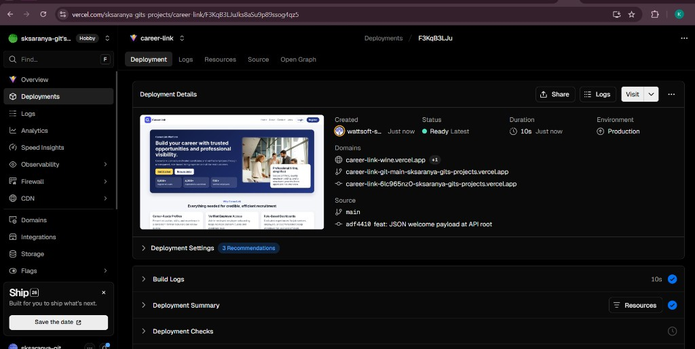
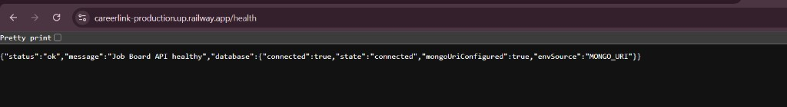
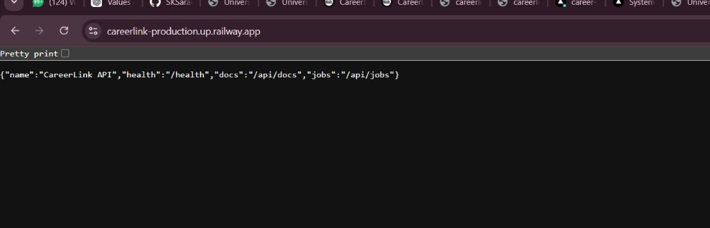
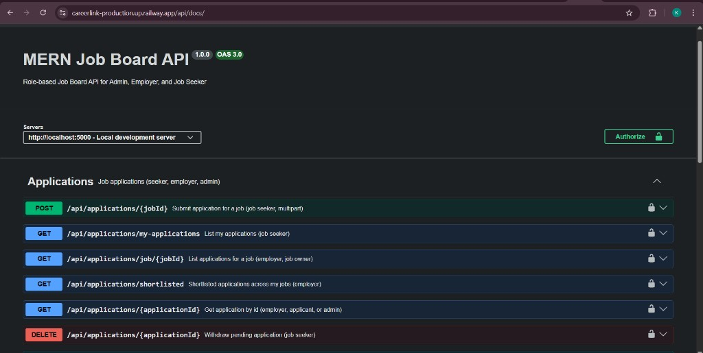
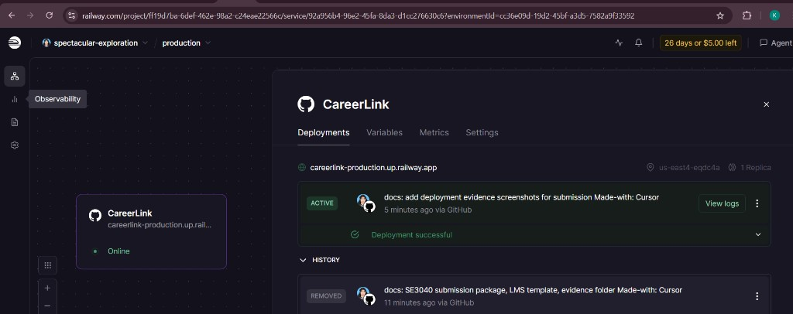
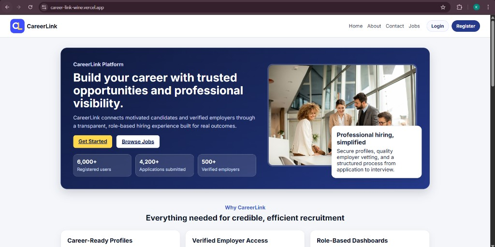

# CareerLink / JobBoard

Full-stack job board (Express + MongoDB + React). SE3040-style structure: REST API, role-based access, Swagger docs, React UI.

**SE3040 documentation map:** **Setup** → below. **API endpoints** (methods, auth, request/response schemas, try-it-out) → **Swagger UI** at `/api/docs` and written notes in [`backend/src/docs/README.md`](backend/src/docs/README.md). **Deployment** → [Deployment report](#deployment-report). **Testing** → [Testing instruction report](#testing-instruction-report-se3040) and [Testing](#testing).

## Prerequisites

- Node.js 18+
- MongoDB URI (`MONGO_URI` in `backend/.env`)

## Setup

### Backend

```bash
cd backend
cp .env.example .env   # if you use an example file; otherwise create .env
# Set MONGO_URI, JWT_SECRET, etc.
npm install
npm run dev
```

API default: `http://localhost:5000`  
Swagger UI: `http://localhost:5000/api/docs`

### Frontend

```bash
cd frontend
npm install
npm run dev
```

App default: `http://localhost:5173`

### Monorepo (both)

From repository root:

```bash
npm install
npm run dev
```

---

## UI: Tailwind CSS

Tailwind is installed for **spec compliance** (utility framework). It is loaded as **`@tailwind utilities` only** with **Preflight disabled**, so existing `frontend/src/styles.css` rules are **not reset** and the current look stays the same. You can add Tailwind classes in new or updated components when you choose.

---

## Testing instruction report (SE3040)

This section satisfies the assignment requirement for **how to run tests** and **testing environment configuration**.

### i. How to run unit tests

From `backend/`, run `npm test` (see **Unit tests** below). No database is required for the default suite.

### ii. Integration testing — setup and execution

Requires `MONGO_URI` in `backend/.env` and `RUN_INTEGRATION=1`. Commands are under **Integration tests** below. Integration files live in `backend/src/tests/integration/`.

### iii. Performance testing — setup and execution

Start the API (`npm start` in `backend`), then in another terminal run `npm run test:perf` from `backend/`. Configuration: `backend/artillery.yml`.

### iv. Testing environment configuration

| Item | Detail |
|------|--------|
| Node.js | 18+ |
| OS | Windows / macOS / Linux (commands shown for Windows PowerShell where relevant) |
| Backend env file | `backend/.env` — `MONGO_URI`, `JWT_SECRET` for integration; unit tests do not require a live DB |
| Integration opt-in | `RUN_INTEGRATION=1` so CI/local runs without Atlas do not fail |
| Performance | API reachable at `config.target` in `artillery.yml` (default `http://localhost:5000`) |

---

## Testing

### Environment

- **Unit + smoke tests:** no database required.
- **Integration tests:** require `MONGO_URI` in `backend/.env` (same as local dev).
- **Performance tests:** API must be running (e.g. `npm start` in `backend` on port 5000).

### Unit tests (backend)

Runs smoke tests (`src/tests/app.test.js`) and isolated unit tests (e.g. `src/utils/__tests__/ApiError.test.js`). Integration folder is excluded.

```bash
cd backend
npm test
```

Run only utility unit tests:

```bash
npm run test:unit
```

### Integration tests (backend)

Hits a real MongoDB via Mongoose. The suite runs only when **both** are set:

- `MONGO_URI` in `backend/.env`
- `RUN_INTEGRATION=1` in the environment (opt-in so unreachable Atlas DNS does not fail grades)

**Windows PowerShell**

```powershell
cd backend
$env:RUN_INTEGRATION="1"
npm run test:integration
```

**cmd**

```bat
cd backend
set RUN_INTEGRATION=1
npm run test:integration
```

If `RUN_INTEGRATION` is not `1`, Jest reports the file as skipped (exit code 0).

### Performance tests (Artillery)

Load profile is defined in `backend/artillery.yml` (public `GET /health` and `GET /api/jobs`). The script runs Artillery via `npx` (no extra global install).

```bash
cd backend
npm start
```

In another terminal:

```bash
cd backend
npm run test:perf
```

To use another base URL, edit `config.target` in `artillery.yml`.

### Frontend tests

No Jest/Vitest suite is configured for React yet; the course requirement is met on the backend side. You can add Vitest later if required.

---

## API documentation

**Assignment requirement (complete endpoint documentation):** Use **Swagger UI** for every route’s HTTP method, path, parameters, request/response models, status codes, and **Authorize** (JWT). Use [`backend/src/docs/README.md`](backend/src/docs/README.md) for narrative notes, sample payloads, and auth expectations. The summary table below is a quick index only.

### Interactive (Swagger)

- **Local:** `http://localhost:5000/api/docs`
- **Production:** [https://careerlink-production.up.railway.app/api/docs](https://careerlink-production.up.railway.app/api/docs)

### Written reference

See [`backend/src/docs/README.md`](backend/src/docs/README.md) for path-level notes, sample payloads, and auth expectations.

### API endpoint overview (assignment summary)

| Area | Base path | HTTP | Authentication |
|------|-----------|------|----------------|
| Health | `/health` | GET | None |
| API root | `/` | GET | None (welcome JSON) |
| Auth | `/api/auth` | POST (register, login, …) | Public / returns JWT |
| Users | `/api/users` | GET, PATCH, … | Bearer JWT; role-based |
| Jobs | `/api/jobs` | GET public; POST/PATCH/DELETE employer | Mixed |
| Applications | `/api/applications` | POST, GET, PATCH, DELETE | Bearer JWT; seeker / employer / admin |
| Application notes | `/api/applications/.../notes`, `/api/application-notes/...` | CRUD | Employer (job owner) |
| Interviews | `/api/interviews` | CRUD-style | Authenticated |
| Notifications | `/api/notifications` | Per routes | Authenticated |
| Admin | `/api/admin` | Per routes | Admin role |

**Authentication:** Protected routes expect header `Authorization: Bearer <JWT>` unless noted. **Request/response shapes** and status codes are defined in Swagger and in `backend/src/docs/README.md`.

---

## Deployment report

### Backend (example: Railway, Render, or similar)

#### Railway (monorepo)

1. **New project** → deploy from **GitHub** → select **CareerLink**.
2. **Root Directory:** leave as **repository root** (empty) **or** set to `backend` — both work:
   - **Root (recommended):** uses the repo `Dockerfile` + `railway.json` / `railway.toml` at the top level.
   - **`backend` only:** uses `backend/Dockerfile` and `backend/railway.json`.
3. **If you see “Error creating build plan with Railpack”:** Railway is using **Railpack** instead of Docker. Fix it either way:
   - **A (best):** Push the latest repo (includes `railway.toml` + root `Dockerfile`), set **Root Directory** to **empty**, then **Redeploy**.
   - **B:** Open the service → **Settings** → **Build** → set **Builder** to **Dockerfile** (not Railpack / Auto) → **Dockerfile path** `Dockerfile` if root, or `backend/Dockerfile` if Root Directory is `backend` → save and redeploy.
4. **Variables** tab: add `MONGO_URI` (or `DATABASE_URL` from a Mongo plugin), `JWT_SECRET`, `CLIENT_URL` (your Vercel URL), `ADMIN_INVITE_CODE` (for admin registration), and optionally `NODE_ENV=production`. Railway injects `PORT` automatically.
5. **Settings** → **Networking** → **Generate Domain** (otherwise the service stays “unexposed” and has no public URL).
6. Redeploy after saving variables.

**Healthcheck failures (build OK, deploy OK, then “Healthcheck failure”):** The API must listen on **`0.0.0.0`** and **`MONGO_URI` must be set** in Railway **Variables**. For **MongoDB Atlas**, open **Network Access** and allow **`0.0.0.0/0`** (or Railway’s egress) so the container can connect; otherwise the app may not finish booting in time for checks.

**Check database connectivity in production:** Open `GET /health` on your deployed API. The JSON includes **`database.connected`** (`true` when Mongoose is connected), **`database.state`**, **`mongoUriConfigured`**, and **`envSource`** (`MONGO_URI`, `DATABASE_URL`, or `MONGODB_URI` — which key is set, not the secret). If `mongoUriConfigured` is false, add a URI variable in Railway Variables and redeploy. If it is true but `connected` stays false, fix **Atlas Network Access** (allow `0.0.0.0/0` for class demos) and confirm the connection string user/password/database name.

#### Other hosts (Render, Fly.io, etc.)

Use **Root Directory** `backend` (or equivalent), **start command** `npm start`, Node **18+**, and the same variables as below.

**Environment variables** (names only; do not commit secret values):

| Variable | Purpose |
|----------|---------|
| `PORT` | HTTP port (often provided by the host) |
| `NODE_ENV` | `production` |
| `MONGO_URI` | MongoDB connection string |
| `JWT_SECRET` | Secret for signing JWTs |
| `CLIENT_URL` | Deployed frontend URL (CORS) |
| `ADMIN_INVITE_CODE` | Secret phrase for admin self-registration |
| `SMTP_*` / `EMAIL_FROM` | Optional: email (see `backend/.env.example`) |

Note the public **API base URL** (for example `https://your-api.up.railway.app`).

### Frontend (Vercel)

1. Project linked to GitHub **CareerLink**; **root directory** set to `frontend` (monorepo).
2. **Build:** `npm run build` — **output:** `dist`.
3. **Environment variable (Production):** `VITE_API_BASE_URL` = `https://careerlink-production.up.railway.app/api`

### Live URLs (submission)

| Service | URL |
|---------|-----|
| **Deployed backend API** | [https://careerlink-production.up.railway.app](https://careerlink-production.up.railway.app) |
| **API health check** | [https://careerlink-production.up.railway.app/health](https://careerlink-production.up.railway.app/health) |
| **Swagger (production)** | [https://careerlink-production.up.railway.app/api/docs](https://careerlink-production.up.railway.app/api/docs) |
| **Deployed frontend** | [https://career-link-wine.vercel.app](https://career-link-wine.vercel.app) |

### Evidence (screenshots)

See **[SE3040 — Submission package](#se3040--submission-package)** below: add PNGs to [`docs/evidence/`](docs/evidence/) and embed them in this README, and use the same images in your **LMS Word** document.

---

## SE3040 — Submission package

Use this section for **AF / LMS** expectations: everything is either in this README or in [`docs/`](docs/).

| Deliverable | Where |
|-------------|--------|
| Setup instructions | [Setup](#setup) |
| API endpoint documentation | [API documentation](#api-documentation) + Swagger + `backend/src/docs/README.md` |
| Deployment report | [Deployment report](#deployment-report) |
| Testing instruction report | [Testing instruction report (SE3040)](#testing-instruction-report-se3040) + [Testing](#testing) |
| LMS Word document (group + repo link + screenshots) | Template: [`docs/LMS-Submission-Template.md`](docs/LMS-Submission-Template.md) — copy into Word, fill placeholders, insert pictures, upload to LMS |
| Evidence files on GitHub | [`docs/evidence/`](docs/evidence/) — see [`docs/evidence/README.md`](docs/evidence/README.md) |

### Embedded deployment evidence (GitHub README)

Screenshots live under `docs/evidence/` (see table). All listed files are committed for submission evidence.

| File | Capture |
|------|---------|
| `01-frontend-vercel.png` | Vercel **Production** deployment (domains + preview) |
| `02-api-health.png` | `/health` with `"status":"ok"` and **`database.connected": true`** |
| `03-api-root.png` | API **root** (`/`) welcome JSON on Railway |
| `04-swagger.png` | Swagger UI **`/api/docs`** (production) |
| `05-railway-deploy.png` | Railway **Deployment successful** / **ACTIVE** |
| `06-frontend-live.png` | Live site **`career-link-wine.vercel.app`** (address bar visible) |













---

## Frontend: state management, session, deployment (SE3040 Part 2)

- **Architecture:** React functional components and hooks.
- **State:** Global auth/session via **React Context** (`AuthContext`); local state with `useState` / `useReducer` in pages and components.
- **Session:** JWT stored and sent with API requests (see `frontend/src/api/axios.js`); protected routes via route wrappers; auth state in `frontend/src/context/AuthContext.jsx`; role-based UI (job seeker / employer / admin).
- **Deployment:** Production build on **Vercel**; API base URL from `VITE_API_BASE_URL`.

---

## Submission checklist (group)

- [ ] Source code on GitHub: [CareerLink](https://github.com/SKSaranya-git/CareerLink.git)
- [ ] README includes setup, API documentation, deployment report, testing instruction report, **live URLs** (above)
- [ ] Environment variable **names** documented; **no secrets** committed
- [ ] Screenshots added to [`docs/evidence/`](docs/evidence/) and committed (see [Embedded deployment evidence](#embedded-deployment-evidence-github-readme))
- [ ] **LMS:** Word document from [`docs/LMS-Submission-Template.md`](docs/LMS-Submission-Template.md) — group ID, all names & student IDs, repo link, embedded screenshots (use files in `docs/evidence/`) — **upload to LMS submission link**
- [ ] Git history: meaningful commits and workflow (branches/PRs as required by module)
- [ ] `git push origin main` after final changes (evidence images included)

Repository: [https://github.com/SKSaranya-git/CareerLink.git](https://github.com/SKSaranya-git/CareerLink.git)
